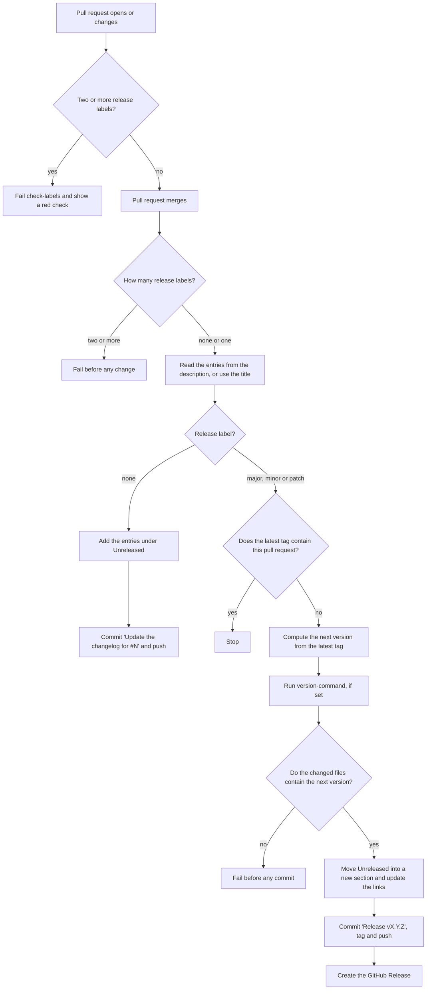

# How it works

This diagram shows every step of the action. The [README](../README.md) gives
the short version.

```mermaid
flowchart TD
  open["Pull request opens or changes"]
  labels{"Two or more release labels?"}
  block["Fail check-labels and show a red check"]
  merged["Pull request merges"]
  label{"How many release labels?"}
  conflict["Fail before any change"]
  entries["Read the entries from the description, or use the title"]
  level{"Release label?"}
  unreleased["Add the entries under Unreleased"]
  commit["Commit 'Update the changelog for #N' and push"]
  released{"Does the latest tag contain this pull request?"}
  stop["Stop"]
  bump["Compute the next version from the latest tag"]
  command["Run version-command, if set"]
  check{"Do the changed files contain the next version?"}
  fail["Fail before any commit"]
  section["Move Unreleased into a new section and update the links"]
  push["Commit 'Release vX.Y.Z', tag and push"]
  release["Create the GitHub Release"]

  open --> labels
  labels -- yes --> block
  labels -- no --> merged --> label
  label -- "two or more" --> conflict
  label -- "none or one" --> entries --> level
  level -- none --> unreleased --> commit
  level -- "major, minor or patch" --> released
  released -- yes --> stop
  released -- no --> bump --> command --> check
  check -- no --> fail
  check -- yes --> section --> push --> release
```
